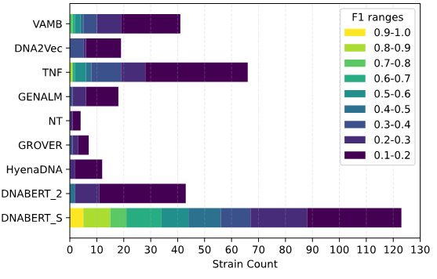

# Benchmarking DNA Foundation Models on Binning Human Gut Microbial Strains
Anders Hjulmand, Andreas Flensted, Eisuke Okuda.


### 1. Introduction
We benchmark six DNA foundation models along with three baselines on metagenomics binning using strain-level resolution data from the human gut micro-biome. Additionally, we perform a genus-level clustering.

**Result:** One DNA foundation model, DNABERT-S, outperforms the others, whilst the remaining perform worse than the baseline models.



### 2. Data

1. Download the data [here](https://figshare.com/articles/dataset/MetaHIT_error-free_contigs_from_MetaBAT/27933807?file=50894283).

2. Move the file `contigs.fna.gz` to the folder `data/metahit` .

### 3. Usage


#### 3.1 Data format

`contigs.fna.gz` is a compressed FASTA file with two lines per contig. The first line is starts with a `>` and is followed by reference numbers, genome of origin, and position of the contig on the genome. The second line is the DNA sequence.
```
>gi|224815735|ref|NZ_ACGB01000001.1|_[Acidaminococcus_D21_uid55871]_1-5871
TAAAGGTCATACTCCTTTTGTGATGCTTCCAAAACATGGTATGGTTCATGTTCCGCAAAGATATGGAGGTCACT
```

`contigs.fna.gz` is processed in `src/utils.py/preprocess_contigs` and saved as a `species_labelled_contigs.csv` in the format:

```
id, sequence, genome
0,  TAAAGGTC, Acidaminococcus_D21_uid55871
```

#### 3.2 Setup

1. Clone the repository: `git clone https://github.com/eisuke119/Research-Project.git`.
2. Change to Research-Project directory: `cd Research-Project`.
3. Install the requirements: `pip install -r requirements.txt`.
4. Depending on environmnet uninstall triton package: `pip uninstall triton`.

#### 3.3 Reproduce results

1. Run the main processing script: `python main.py`.
2. If you do not want to run all models go to `config/models.yml` and comment out the models.
3. To reproduce figures, run the notebooks in the folder `figure_notebooks/`.


#### 3.4 Remarks

1. The computed embeddings take up 30GB of space. 
2. We used 2x L40 GPUs to compute the embeddings. 


